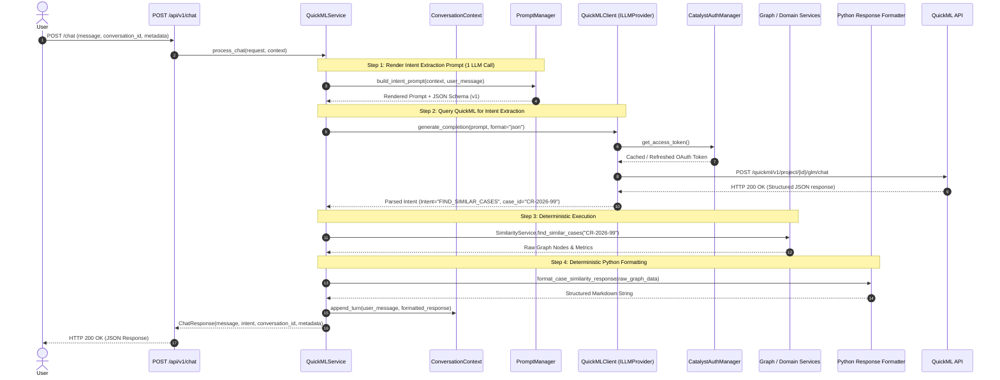
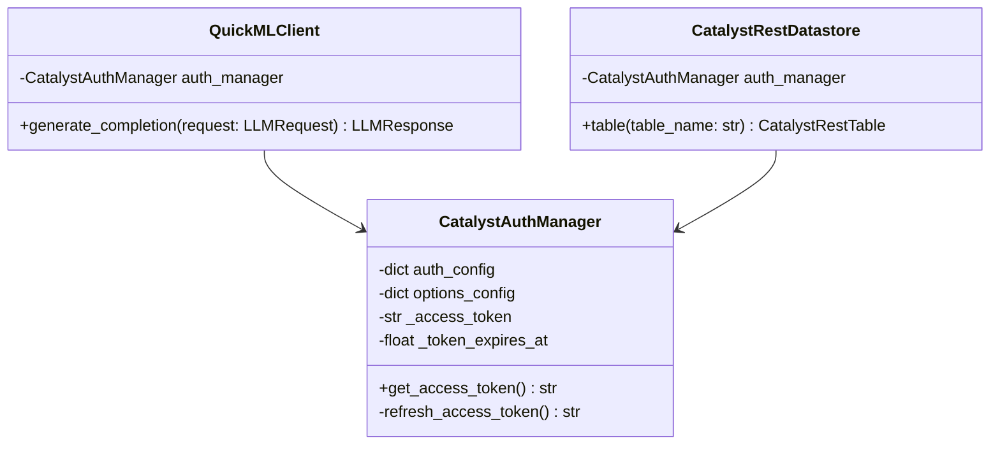
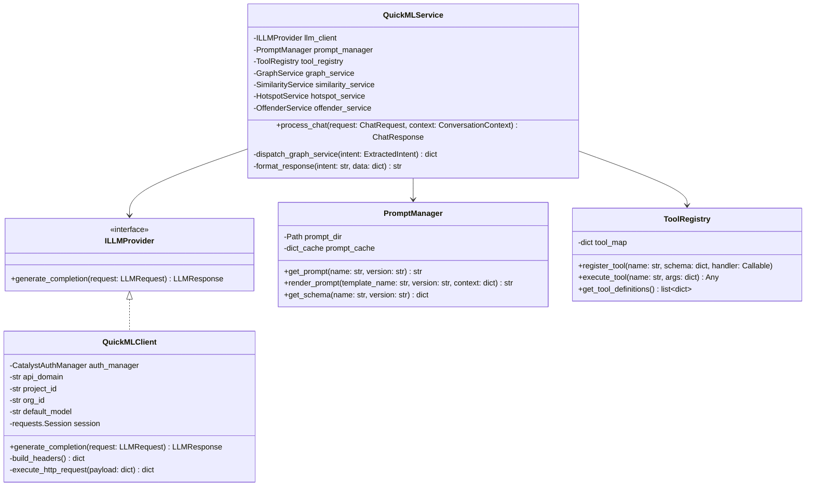

# Refined Enterprise Architecture Blueprint: Zoho Catalyst QuickML Integration for CaseClock

**Role:** Principal Python Backend Architect  
**Project:** CaseClock Backend  
**Target Subsystem:** AI Layer (`backend/app/ai/`)  
**Status:** Architectural Specification  

---

## Architectural Modifications & Context

This document specifies the architecture for integrating **Zoho Catalyst QuickML** into the **CaseClock** backend while preserving strict **Clean Architecture** principles, single source of truth for deterministic graph services, and clean component isolation.

### Summary of Architecture Refinement Decisions

| Refinement | Enterprise Proposal | Refined Architecture | Architectural Rationale & Maintainability Gain |
| :--- | :--- | :--- | :--- |
| **1. Folder Structure** | Nested under `backend/app/core/llm/` (4 subfolders) | Flat & consolidated in `backend/app/ai/` | Eliminates deep directory traversal while keeping all AI components co-located. |
| **2. Client/Adapter Layer** | `QuickMLClient` $\rightarrow$ `QuickMLAdapter` $\rightarrow$ `ILLMProvider` | `QuickMLClient` directly implements `ILLMProvider` | Removes indirect wrapper layer. Reduces mental overhead while keeping HTTP logic encapsulated. |
| **3. Service Orchestration** | `ChatOrchestrator` + `IntentDispatcher` | Consolidated `QuickMLService` | Reduces class count. `QuickMLService` directly orchestrates prompt building, LLM execution, graph dispatch, and formatting. |
| **4. Ingestion Lifecycle** | 2-Pass LLM Calls (Intent Extraction + Synthesis) | **1-Pass LLM Call** (Intent Extraction $\rightarrow$ Graph $\rightarrow$ Python Formatter) | Cuts QuickML API latency by ~50%, slashes token cost, simplifies debugging, and avoids LLM hallucination on final output formatting. |
| **5. OAuth Design** | `CatalystOAuthTokenProvider` wrapping `CatalystRestDatastore` | Extracted standalone `CatalystAuthManager` | Decouples OAuth management from database repositories. Shared cleanly by both `QuickMLClient` and `CatalystRestDatastore`. |
| **6. Context Management** | Raw prompt strings / single message | Typed `ConversationContext` model | Enables multi-turn conversation state, tracking session metadata, and managing message windows cleanly. |
| **7. Prompt Versioning** | Unversioned `.txt` files | Explicitly versioned templates (`*_v1.txt`) | Guarantees safe deployments, zero-downtime prompt migration, and regression testing. |
| **8. Observability** | Basic JSON token logging | Full structured telemetry & redaction rules | Enforces end-to-end tracing across request ID, intent, graph calls, tokens, latency, and strict credential masking. |

---

## 1. System Architecture Diagram

```mermaid
graph TD
    subgraph Presentation_Layer ["Presentation Layer"]
        Router["POST /api/v1/chat<br/>(chat_routes.py)"]
        DTO["ChatRequest / ChatResponse DTOs<br/>(chat_schemas.py)"]
    end

    subgraph AI_Subsystem ["AI Subsystem (backend/app/ai/)"]
        Context["ConversationContext<br/>(schemas.py)"]
        Service["QuickMLService<br/>(quickml_service.py)"]
        PromptMgr["PromptManager<br/>(prompt_manager.py)"]
        ToolReg["ToolRegistry<br/>(tool_registry.py)"]
        
        subgraph Domain_Abstractions ["Abstractions & Interfaces"]
            ILLM["ILLMProvider (Interface)<br/>(quickml_client.py)"]
        end

        subgraph Infrastructure ["Infrastructure / Transport"]
            Client["QuickMLClient<br/>(Implements ILLMProvider)"]
        end
    end

    subgraph Auth_Infrastructure ["Shared Auth Infrastructure"]
        AuthMgr["CatalystAuthManager<br/>(backend/app/auth/catalyst_auth.py)"]
    end

    subgraph Deterministic_Services ["Deterministic Graph & Domain Services (Source of Truth)"]
        GS["GraphService"]
        SS["SimilarityService"]
        NS["NetworkService"]
        HS["HotspotService"]
        OS["OffenderService"]
        CE["ClockEngine"]
        Formatter["Python Response Formatter<br/>(formatters.py)"]
    end

    subgraph External_APIs ["External Services"]
        QuickMLAPI["Zoho Catalyst QuickML Endpoint<br/>(/quickml/v1/project/{id}/glm/chat)"]
        ZohoOAuth["Zoho Accounts OAuth Server<br/>(/oauth/v2/token)"]
    end

    %% Flow Connections
    Router --> DTO
    Router --> Service
    Service --> Context
    Service --> PromptMgr
    Service --> ILLM
    Service --> ToolReg
    Service --> Deterministic_Services
    
    Deterministic_Services --> Formatter
    Formatter --> Service

    Client ..|> ILLM
    Client --> AuthMgr
    Client --> QuickMLAPI
    
    AuthMgr --> ZohoOAuth
```

---

## 2. Refined Directory & Folder Structure

```
backend/app/
├── ai/
│   ├── __init__.py
│   ├── quickml_client.py       # Implements ILLMProvider. Low-level HTTP, retries, timeouts, OAuth.
│   ├── quickml_service.py      # High-level orchestrator: prompts -> LLM -> Graph -> Python Formatter.
│   ├── prompt_manager.py       # Template loader and renderer for versioned prompts.
│   ├── tool_registry.py        # Executable Tool Registry for current & future function calling.
│   ├── schemas.py              # Pydantic models: ChatRequest, ChatResponse, ConversationContext, Intent.
│   ├── exceptions.py           # Subsystem exceptions: LLMError, QuickMLClientError, IntentParsingError.
│   └── prompts/
│       ├── system_prompt_v1.txt    # Base system instructions and legal domain constraints (v1).
│       ├── intent_prompt_v1.txt    # Intent & entity extraction instructions (v1).
│       ├── synthesis_prompt_v1.txt # (Optional) Two-pass natural language synthesis prompt (v1).
│       └── schemas/
│           ├── intent_schema_v1.json   # JSON Schema enforcing output format of extracted intent.
│           └── tool_schemas/           # JSON Schemas for tool definitions.
│               ├── find_similar_cases.json
│               ├── get_repeat_offenders.json
│               └── get_hotspots.json
│
├── auth/
│   └── catalyst_auth.py        # Standalone CatalystAuthManager (Extracted OAuth token manager).
│
├── api/
│   └── v1/
│       └── chat_routes.py      # FastAPI POST /chat endpoint.
```

---

## 3. Revised Single-Pass Chat Sequence Diagram



---

## 4. Standalone OAuth Architecture (`CatalystAuthManager`)

To eliminate duplicate OAuth token retrieval logic and avoid using `CatalystRestDatastore` as an auth provider, token handling is extracted into `backend/app/auth/catalyst_auth.py`.



### Responsibility Breakdown
* **Thread-Safe Caching**: Caches `_access_token` in memory with an expiration buffer (~55 minutes).
* **Single Refresh Endpoint Owner**: Issues POST requests to `{accounts_domain}/oauth/v2/token` using `refresh_token`, `client_id`, and `client_secret`.
* **Zero Cross-Dependency**: Neither `QuickMLClient` nor `CatalystRestDatastore` maintain OAuth refresh timers; both invoke `auth_manager.get_access_token()` seamlessly.

---

## 5. Conversation Context Architecture (`ConversationContext`)

The `ConversationContext` model handles conversation history, session identification, and metadata without polluting individual service parameters.

```python
# backend/app/ai/schemas.py

from pydantic import BaseModel, Field
from datetime import datetime, timezone
from typing import Any

class MessageTurn(BaseModel):
    role: str  # "user" | "assistant" | "system"
    content: str
    timestamp: datetime = Field(default_factory=lambda: datetime.now(timezone.utc))
    intent: str | None = None

class ConversationContext(BaseModel):
    conversation_id: str
    user_id: str | None = None
    case_id: str | None = None
    history: list[MessageTurn] = Field(default_factory=list)
    metadata: dict[str, Any] = Field(default_factory=dict)

    def add_user_message(self, content: str) -> None:
        self.history.append(MessageTurn(role="user", content=content))

    def add_assistant_message(self, content: str, intent: str | None = None) -> None:
        self.history.append(MessageTurn(role="assistant", content=content, intent=intent))

    def get_recent_history(self, max_turns: int = 5) -> list[dict[str, str]]:
        """Returns standard dict history window for prompt formatting."""
        return [{"role": msg.role, "content": msg.content} for msg in self.history[-max_turns:]]
```

---

## 6. Revised Class Diagram & Interfaces



---

## 7. Component Responsibilities (Refined AI Subsystem)

### `QuickMLClient` (`backend/app/ai/quickml_client.py`)
* **Role**: Low-level infrastructure gateway implementing `ILLMProvider`.
* **Responsibilities**:
  * Implements `generate_completion(request: LLMRequest) -> LLMResponse`.
  * Fetches valid access tokens from `CatalystAuthManager`.
  * Constructs QuickML payload (`model`, `messages`, `temperature`, `max_tokens`, `chat_template_kwargs`).
  * Manages HTTP execution via `requests.Session`, including connect/read timeouts.
  * Handles retry logic (exponential backoff on 429/5xx status codes).
  * Parses HTTP 200 responses into domain `LLMResponse`.

### `QuickMLService` (`backend/app/ai/quickml_service.py`)
* **Role**: High-level application orchestrator.
* **Responsibilities**:
  * Receives `ChatRequest` and `ConversationContext`.
  * Uses `PromptManager` to construct intent extraction prompt (`intent_prompt_v1.txt`).
  * Calls `QuickMLClient.generate_completion()`.
  * Validates parsed JSON output against `intent_schema_v1.json`.
  * Dispatches target deterministic graph service (`SimilarityService`, `HotspotService`, etc.).
  * Formats raw graph data into human-readable Markdown via deterministic Python response formatters.
  * Updates `ConversationContext` with turn history and returns `ChatResponse`.

### `PromptManager` (`backend/app/ai/prompt_manager.py`)
* **Role**: Versioned template loader and renderer.
* **Responsibilities**:
  * Loads prompts from `backend/app/ai/prompts/{name}_{version}.txt`.
  * Caches templates in memory during application runtime.
  * Renders template variables (e.g., history context, user message, case ID).
  * Loads JSON schemas from `backend/app/ai/prompts/schemas/{name}_{version}.json`.

### `ToolRegistry` (`backend/app/ai/tool_registry.py`)
* **Role**: Tool definition and callback registry for function calling.
* **Responsibilities**:
  * Maintains registry mapping tool names to python callables and JSON schemas.
  * Provides native tool definitions to `QuickMLClient` when tool calling is enabled.
  * Executes tool functions deterministically.

---

## 8. Observability & Logging Strategy

Every chat transaction produces structured log events containing execution telemetry while enforcing strict credential redaction.

### Structured Log Payload Example

```json
{
  "timestamp": "2026-07-25T20:56:00.123Z",
  "level": "INFO",
  "event": "quickml_chat_transaction",
  "request_id": "req-8f92a10b",
  "conversation_id": "conv-4412-9912",
  "user_id": "usr-officer-402",
  "case_id": "CR-2026-104",
  "selected_intent": "FIND_SIMILAR_CASES",
  "graph_service_invoked": "SimilarityService.find_similar_cases",
  "quickml_latency_ms": 342.5,
  "execution_latency_ms": 415.2,
  "http_status": 200,
  "retry_count": 0,
  "token_usage": {
    "prompt_tokens": 210,
    "completion_tokens": 18,
    "total_tokens": 228
  }
}
```

### Strict Redaction & Masking Rules

> [!CAUTION]
> **Data Security Compliance**: The logging layer uses a custom `SanitizingFilter` that redacts sensitive strings before writing to standard output or log drivers.

* **Never Log**: `Authorization` headers, `Zoho-oauthtoken`, `refresh_token`, `client_id`, `client_secret`, `CATALYST_AUTH`, `CATALYST_OPTIONS`.
* **Redaction Filter Regex**: Matches strings resembling OAuth tokens (`1000.[a-f0-9]{32}.[a-f0-9]{32}`) and replaces them with `***REDACTED***`.

---

## 9. Extensibility Blueprint

### Enabling 2-Pass Synthesis (Optional Future Upgrade)
If rich, conversational responses are required later instead of deterministic Python formatting:
1. Set feature flag `CASECLOCK_AI_TWO_PASS_SYNTHESIS=true`.
2. `QuickMLService` will execute Pass 2 by passing raw graph JSON data to `PromptManager.render("synthesis_prompt", "v1")` and invoking `QuickMLClient` a second time.
3. No refactoring or structural changes required.

### Tool Calling Integration
When transitioning to native Tool Calling:
1. Register graph service methods in `ToolRegistry`.
2. `QuickMLService` passes `tool_registry.get_tool_definitions()` to `QuickMLClient`.
3. If QuickML returns `LLMResponse.tool_calls`, `QuickMLService` loops over `tool_registry.execute_tool()`.

### RAG & Knowledge Base
Context chunks retrieved from vector search or document repositories are passed directly into `ConversationContext.metadata["rag_chunks"]` and injected by `PromptManager` into system prompts.

### Zia Voice
Voice streams parsed by Zia Voice are converted to text at the gateway layer, passed into `QuickMLService.process_chat()`, and the resulting markdown output is passed back to Zia Text-to-Speech without altering AI subsystem logic.

---

## 10. Summary of Architectural Gains for CaseClock

1. **Zero Code Duplication**: OAuth management is unified under `CatalystAuthManager`.
2. **Simplified Folder Topology**: Flat, co-located architecture in `backend/app/ai/`.
3. **50% Latency & Cost Reduction**: Single-pass intent extraction with deterministic Python response formatting.
4. **Strict Isolation**: QuickML remains an NLU gateway; deterministic graph services remain the sole source of truth.
5. **Turnkey Extensibility**: Prepared for Tool Calling, RAG, and multi-turn session handling.
